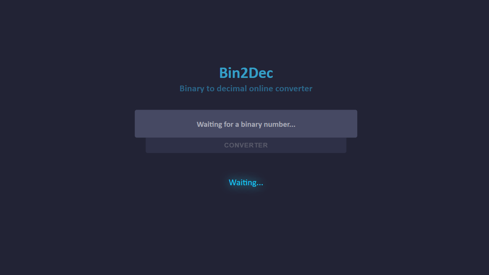

# Conversor de Binários

<!--ts-->
* [Sobre](#sobre)
* [Status](#status)
* [Features](#features)
* [Requisitos](#pré-requisitos)
* [Tecnologias](#tecnologias)
* [Autor](#autor)
<!--td-->

## Sobre
Conversor de números binários para decimais com `ReactJS` fazendo uso de `useStates()` e `useEffect()`.

Aplicação desenvolvida com fins educativos para praticar a biblioteca.

----
## Status
#### Concluído :white_check_mark:
----
## Features
- [x] Converter binários para decimais
---
## Pré-Requisitos
- Para executar a aplicação:
  - Tenha certeza que está com o `node` instalado;
  - Execute o comando `node install` ou `node i`;
  - Execute a aplicação com `npm run dev`; 
---
## Tecnologias
- React
- StyledComponents
- Vite
----
## Aplicação Online
#### Veja o projeto [aqui](https://binary-conversor.netlify.app/)
----
### Inspiração
Projeto feito com base em uma suegetão do repositório 
----
### Autor 

#### [Paulo Valleriote](https://www.linkedin.com/in/paulovalleriote/)
##### Desenvolvedor Full-Stack em Formação
###### Cursando Desenvolvimento de Software na Cubos Academy
